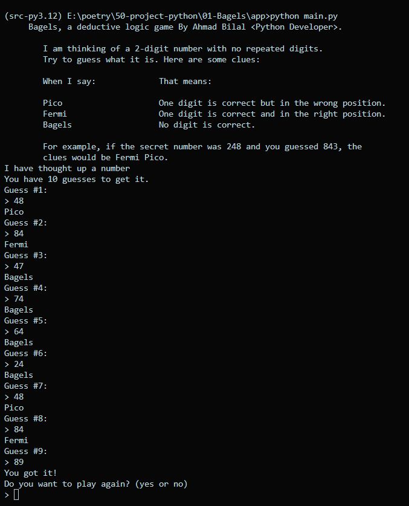

<a href="https://www.linkedin.com/feed/update/urn:li:activity:7216469274356293632/" target="_blank"> <h1>🔅 Bagels Game 🔅</h1></a>

 

In Bagels, a deductive logic game, you
must guess a secret three-digit number
based on clues. The game offers one of
the following hints in response to your guess:
“Pico” when your guess has a correct digit in the
wrong place, “Fermi” when your guess has a correct
digit in the correct place, and “Bagels” if your guess
has no correct digits. You have 10 tries to guess the
secret number.

 

# 📝 After Running the Bagels Game display look like ⬇️
