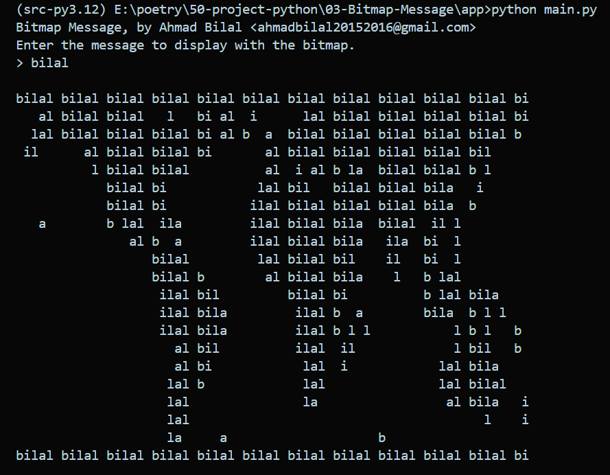

<h1>🎆🎇🎉✨ BITMAP MESSAGE 🎉🎇✨🎆</h1>

 

This program uses a multiline string as a
bitmap, a 2D image with only two possible
colors for each pixel, to determine how it
should display a message from the user. In this
bitmap, space characters represent an empty space,
and all other characters are replaced by characters in
the user’s message. The provided bitmap resembles
a world map, but you can change this to any image
you’d like. The binary simplicity of the space-ormessage-characters system makes it good for beginners. Try experimenting with different messages to
see what the results look like!

 

## 📝 After Running the code display look like ⬇️
