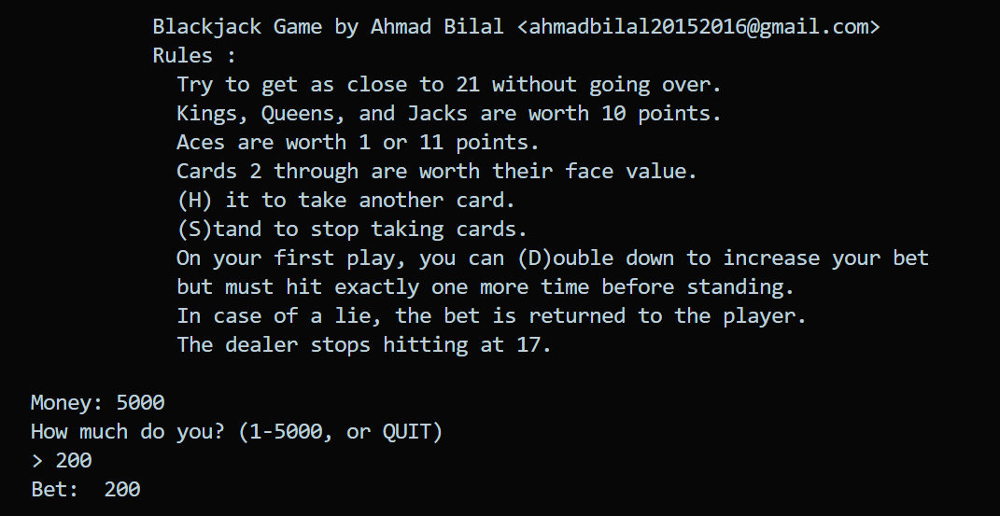
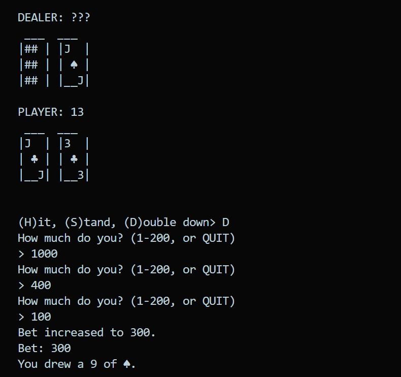
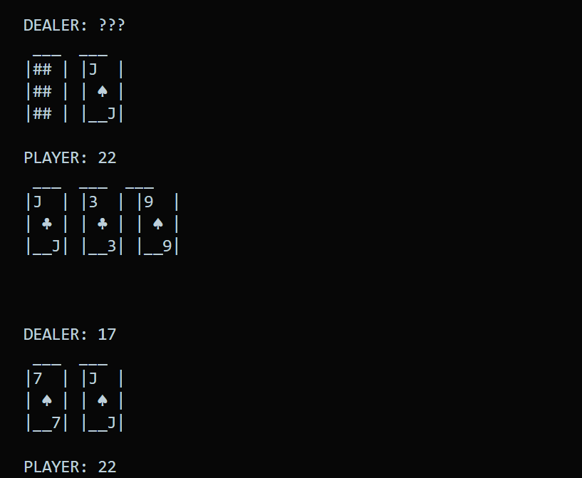
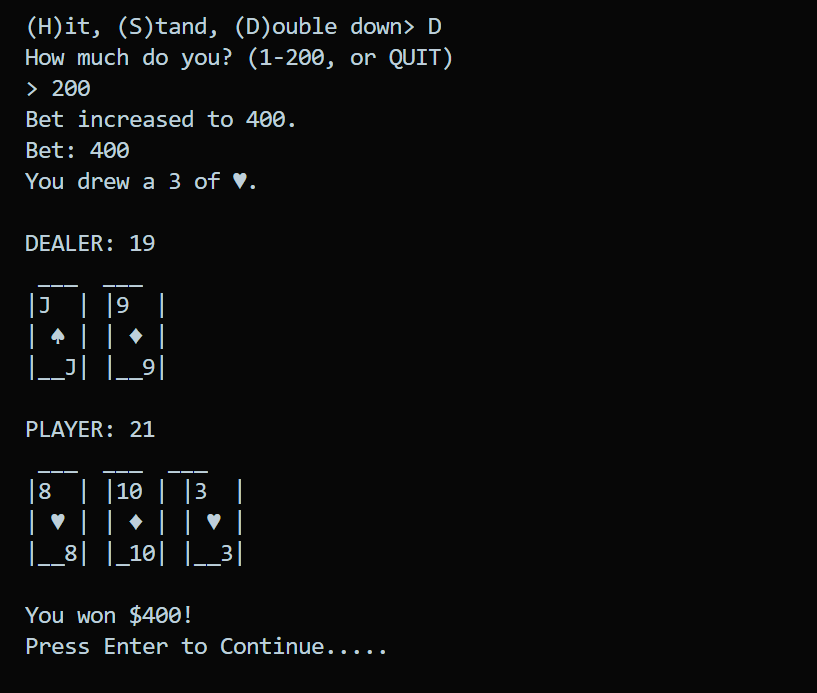
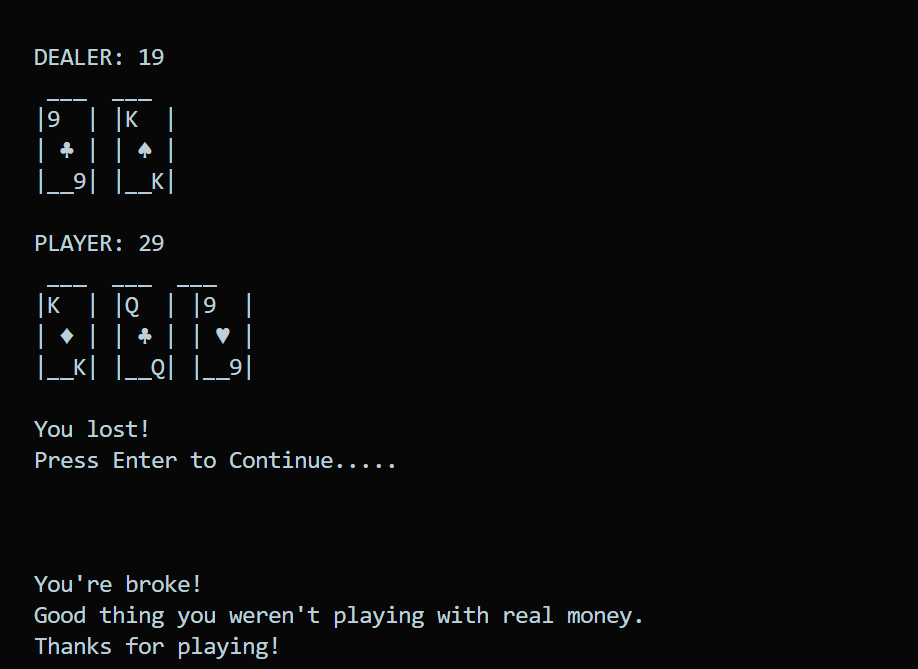

<h1> ✨ Blackjack Game ✨ </h1>

 

Blackjack, also known as 21, is a card game
where players try to get as close to 21 points
as possible without going over. This program
uses images drawn with text characters, called
ASCII art. American Standard Code for Information
Interchange (ASCII) is a mapping of text characters
to numeric codes that computers used before Unicode
replaced it.

⚠️ Rules:

 Try to get as close to 21 without going over.
 Kings, Queens, and Jacks are worth 10 points.
 Aces are worth 1 or 11 points.
 Cards 2 through 10 are worth their face value.
 (H)it to take another card.
 (S)tand to stop taking cards.
 On your first play, you can (D)ouble down to increase your bet
 but must hit exactly one more time before standing.
 In case of a tie, the bet is returned to the player.
 The dealer stops hitting at 17.

 

## 📝 After Running the code display look like ⬇️

